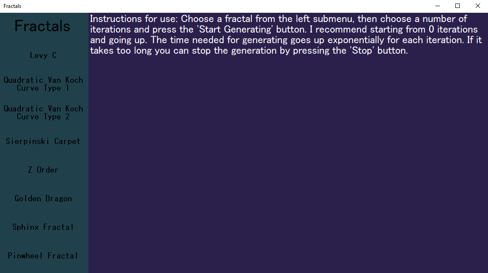
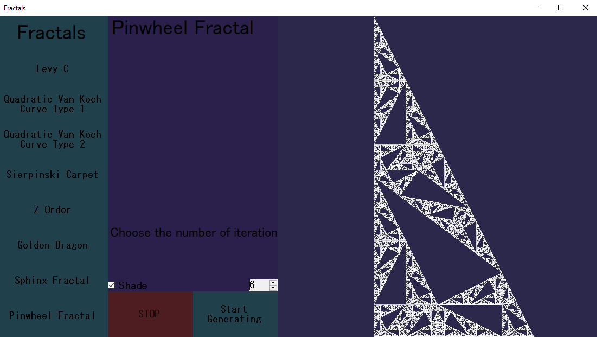
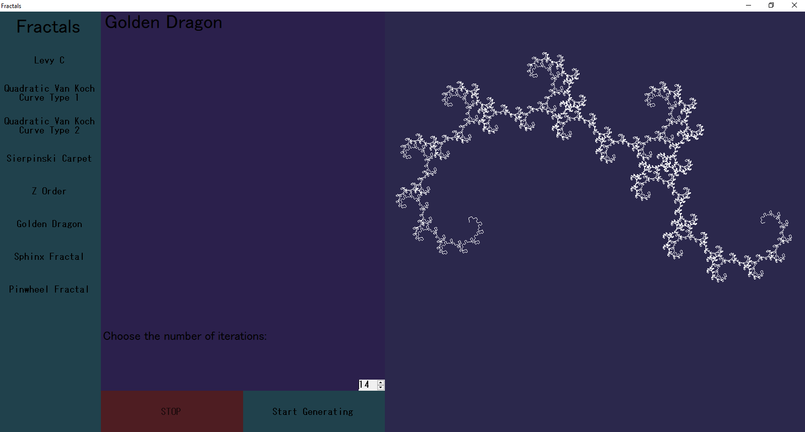
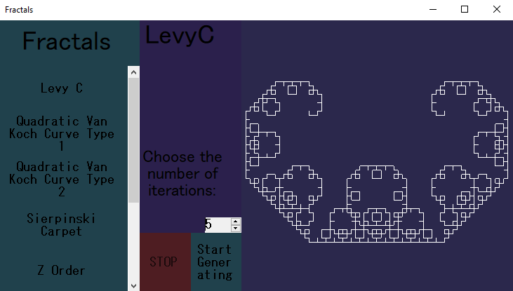

# Fractals App

## To run the app go to the 'Release' folder and run the executable.
Alternatively you can open the solution 'Fractals.sln' in Visual Studio 2019 and press 'Start' to run the app.

## Description

This app is built with C# in Visual Studio. It is a responsive Windows application that recursively generates some fractals and gives full control over the number of iterations. It also shows the drawing process.

The app is responsive and can adapt to diferent screen sizes without losing any details.

